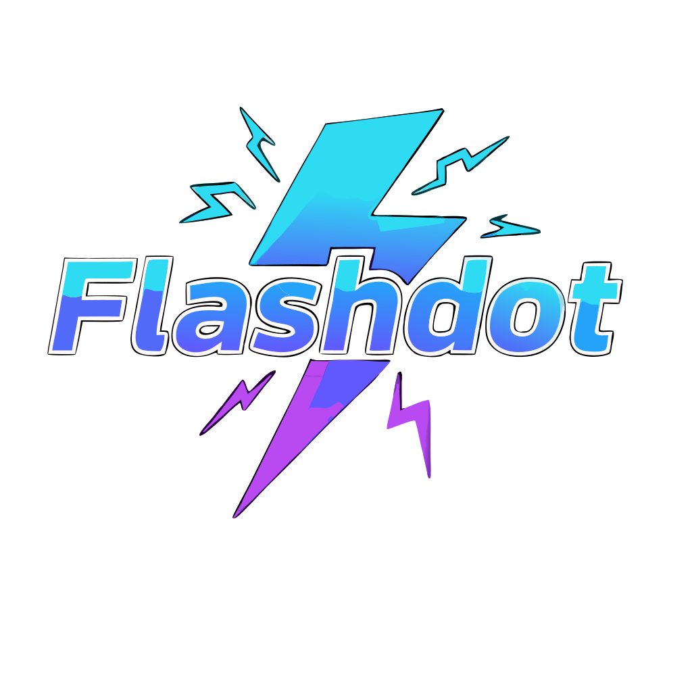

# FlashDot - An observation, this is an Vibe Coding project.

<p align="center">
  
</p>

<p align="center">
  <strong>A creative animation and interactive tool blending Adobe Flash Animate workflows with the power of Godot Engine 4.x</strong>
</p>

<p align="center">
  
  
  
</p>

## 🎯 Overview

FlashDot enables artists and animators to create frame-by-frame animations, vector graphics, and simple interactivity using familiar Flash-like workflows within Godot's open-source ecosystem. Preserve the creative flow you know while leveraging modern, cross-platform delivery.

## ✨ Features

### Current Development Focus
- **Timeline & Keyframes**: Frame-based editor with onion-skinning support
- **Vector Drawing Tools**: Pen, shape, and node-editing capabilities
- **Symbol Library**: Create, nest, and reuse assets efficiently
- **Layer Management**: Show/hide/reorder layers with ease

### Planned Features
- **Shape Tweening**: Smooth transitions between vector shapes
- **Basic Interactivity**: Drag-and-drop behaviors and button triggers
- **Media Import**: Support for PNG, SVG, and audio files
- **Export Options**: Generate Godot scenes (.tscn) and HTML5 builds
- **Plugin API**: Community-extensible architecture

## 🎨 Design Philosophy

FlashDot maintains the intuitive UI and workflow familiarity of Adobe Flash Animate while embracing:
- Open-source accessibility
- Cross-platform compatibility
- Modern performance standards
- Community-driven development

### Color Palette
- **Cyan Accent**: `#2EDBF3`
- **Blue Primary**: `#4565FF`
- **Magenta Highlight**: `#B94AF1`

## 🚀 Getting Started

### Prerequisites
- [Godot Engine 4.4+](https://godotengine.org/download)
- Basic familiarity with Godot's interface

### Installation
1. Clone the repository:
   ```bash
   git clone https://github.com/yourusername/flashdot.git
   cd flashdot
   ```

2. Open the project in Godot:
   - Launch Godot Engine
   - Click "Import" and navigate to the `project.godot` file
   - Select and open the project

3. Run the project to start using FlashDot

## 📋 Roadmap

### Q3 2025 (Current)
- [ ] Timeline editor core implementation
- [ ] Vector drawing tools (pen, shapes)
- [ ] Basic symbol library and UI
- [ ] Godot 4.x compatibility testing

### Q4 2025
- [ ] Shape tweens and easing presets
- [ ] Expanded timeline features
- [ ] Media import capabilities
- [ ] First preview release

### Q1 2026
- [ ] Scripting templates for interactivity
- [ ] Export functionality
- [ ] Plugin API development
- [ ] Beta release testing

[View complete roadmap →](roadmap.md)

## 📖 Documentation

- [Product Requirements Document](prd.md)
- [Development Roadmap](roadmap.md)
- [UI Guidelines](ui.md)
- [Best Practices](best_pratices_godot4x.md)
- [Project Guide](project_guide/)

## 🤝 Contributing

We welcome contributions from the community! Whether you're:
- An animator with Flash experience
- A Godot developer
- A UI/UX designer
- A documentation writer

There's a place for you in the FlashDot project.

### Development Setup
1. Fork the repository
2. Create a feature branch (`git checkout -b feature/amazing-feature`)
3. Follow our [best practices guide](best_pratices_godot4x.md)
4. Commit your changes (`git commit -m 'Add amazing feature'`)
5. Push to the branch (`git push origin feature/amazing-feature`)
6. Open a Pull Request

## 📄 License

This project is licensed under the MIT License - see the [LICENSE](LICENSE) file for details.

## 🎯 Target Audience

- **Animators** transitioning from Adobe Flash
- **Indie developers** creating interactive media
- **Educators** teaching animation and game development
- **Open-source enthusiasts** contributing to creative tools

## 🏗️ Architecture

FlashDot is built as a Godot 4.x plugin/tool, leveraging:
- **GDScript** for core functionality
- **Godot's UI system** for the editor interface
- **Vector graphics capabilities** for drawing tools
- **Scene system** for symbol management

## 🔧 System Requirements

### Minimum
- **OS**: Windows 10, macOS 10.15, or Linux (64-bit)
- **RAM**: 4 GB
- **Storage**: 1 GB available space
- **Graphics**: OpenGL 3.3 compatible

### Recommended
- **RAM**: 8+ GB
- **Graphics**: Dedicated GPU with OpenGL 4.0+
- **Input**: Graphics tablet for vector drawing

## 📞 Support & Community

- **Issues**: [GitHub Issues](https://github.com/yourusername/flashdot/issues)
- **Discussions**: [GitHub Discussions](https://github.com/yourusername/flashdot/discussions)
- **Discord**: [FlashDot Community](https://discord.gg/flashdot) *(coming soon)*

## 🙏 Acknowledgments

- Adobe Flash Animate team for the original inspiration
- Godot Engine community for the amazing foundation
- All contributors and testers helping shape FlashDot

---

<p align="center">
  Made with ❤️ for the animation and game development community
</p>

<p align="center">
  <em>Last updated: July 3, 2025</em>
</p>
